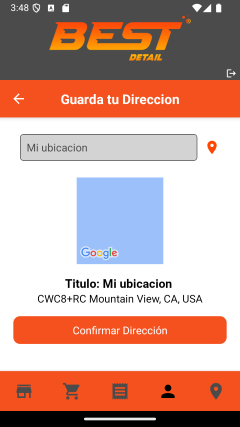

# Proyecto Final de CoderHouse
## Best Detail

Best Detail es una empresa destinada a la venta de productos de la marca Toxic Shine para el cuidado de la estetica vehicular. 
La aplicación es de e-commerce desarrollada con React Native y Expo, permite a los usuarios registrarse, iniciar sesión, elegir productos por categoria, buscalos por nombre, agregar productos al carrito, y realizar compras. Además, se utiliza utiliza SQLite para la persistencia de datos y Firebase para la autenticación y la base de datos en tiempo real.

## Características Principales 
- **Catálogo de Productos**: Explora una lista de productos categorizados para facilitar la búsqueda.
- **Filtrado de Productos por nombre**: Se le facilita al usuario buscar el producto que desee rapidamente.
- **Autenticación de Usuarios**: Registro e inicio de sesión mediante Firebase Authentication, garantizando la seguridad de las credenciales.

- **Carrito de Compras Interactivo**: Añade y elimina productos en tu carrito con una experiencia fluida, y confirma tus compras fácilmente.
- **Persistencia Inteligente**: Datos almacenados de forma local utilizando SQLite, asegurando disponibilidad incluso sin conexión a internet.
- **Integración de Cámara y Ubicación**: Captura imágenes y accede a la ubicación del dispositivo, permitiendo al usuario elegir la foto de perfil que desee y poder guardar su dirección a través de su ubicación.


## Instalación

### Requisitos Previos

- Node.js
- npm 
- Expo (SDK 51)
- Adroid Studio

### Pasos de Instalación

1. Clona el repositorio:

    ```bash
    git clone https://github.com/XxFabio24xX/MDZTech-App
    cd ProyectoFinalCoder
    ```

2. Instala las dependencias:

    ```bash
    npm install
    ```

3. Inicia el proyecto con Expo:

    ```bash
    npx expo start
    ```

## Uso de la Aplicación

### 1. **Registro y Autenticación**
   - Accede a la aplicación y dirígete a la pantalla de registro.
   - Ingresa tu correo electrónico y contraseña para completar el registro.
   - Usa las credenciales registradas para iniciar sesión.

### 2. **Navegación de Productos**
   - Explora la lista de productos organizados por categorías.
   - Selecciona un producto para ver su descripción detallada, precio y disponibilidad.

### 3. **Carrito de Compras**
   - Agrega productos al carrito.
   - Accede al carrito para revisar los productos seleccionados.
   - Finaliza tu compra fácilmente desde la misma sección.

### 4. **Persistencia de Datos**
   - La aplicación almacena datos de manera local utilizando **SQLite**.
   - Tus productos seleccionados y otras configuraciones permanecen guardados entre sesiones.

### 5. **Perfil de Usuario**
   - Usa la cámara del dispositivo para capturar una foto y configurarla como tu imagen de perfil.
   - Usa tu ubicación para poder guardar o cambiar tu dirección de manera sencilla.

### 6. **Nuestra Ubicación**
   - Aprovecha la funcionalidad de geolocalización para poder acceder rapidamente a la ubicación de nuestra tienda a través del mapa.


## Tecnologías Utilizadas

- **React Native**: Para el desarrollo de la aplicación móvil.
- **Redux Toolkit**: Para la gestión del estado global.
- **Firebase**: Para la autenticación y la base de datos en tiempo real.
- **SQLite**: Para la persistencia de datos local.
- **Expo**: Para el desarrollo y la ejecución de la aplicación.
- **react-native-toast-message**: Para mostrar mensajes de toast.
- **react-native-vector-icons**: Para usar íconos vectoriales.
- **react-native-maps**: Para mostrar mapas y marcadores.
- **expo-image-picker**: Para seleccionar y tomar fotos con la cámara.
- **expo-location**: Para obtener la ubicación del dispositivo.

## Dependencias Utilizadas

- `@react-navigation/bottom-tabs`: ^6.6.1
- `@react-navigation/native`: ^6.1.18
- `@react-navigation/native-stack`: ^6.11.0
- `@reduxjs/toolkit`: ^2.3.0
- `expo`: ~51.0.28
- `expo-font`: ~12.0.10
- `expo-image-picker`: ~15.0.7
- `expo-linear-gradient`: ~13.0.2
- `expo-location`: ~17.0.1
- `expo-splash-screen`: ~0.27.7
- `expo-sqlite`: ~14.0.6
- `expo-status-bar`: ~1.12.1
- `react`: 18.2.0
- `react-native`: ^0.74.5
- `react-native-map`: ^0.0.1
- `react-native-maps`: 1.14.0
- `react-native-safe-area-context`: 4.10.5
- `react-native-screens`: 3.31.1
- `react-native-toast-message`: ^2.2.1
- `react-native-vector-icons`: ^10.2.0
- `react-redux`: ^9.1.2
- `yup`: ^1.4.0

## Wireframe
Este es un wireframe básico de la aplicación:

## Capturas de Pantalla 
Se muestra el funcionamiento de la aplicación: 
### Pantallas de inicio


### Pantallas del Shop


Producto filtrado por nombre 


### Pantalla del Carrito y Orden generada


### Pantallas del Perfil y Direccion




### Pantalla de Ubicación


